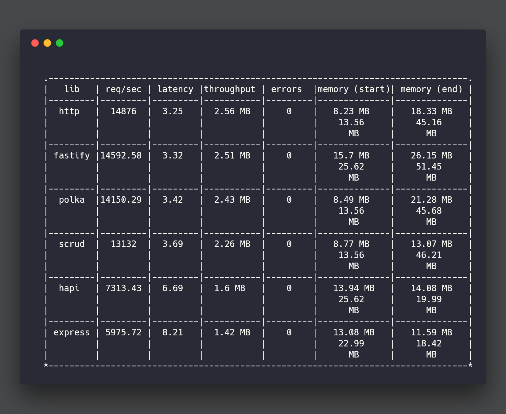

<div align="center">
  
</div>

# scrud [](https://npmjs.org/package/scrud)   [](https://github.com/feross/standard)   [](https://dependencyci.com/github/doesdev/scrud)

> SCRUD API server, fast, light, capable

# what is SCRUD

It's just [CRUD](https://en.wikipedia.org/wiki/Create,_read,_update_and_delete) with a search action included in the package.
- search
- create
- read
- update
- delete

Every resource has corresponding SCRUD actions which are expressed in the HTTP methods and path (resource ids and query params).

# what is this module

- a performance minded API server
- a resourceful SCRUD based router
- a collection of tools that allow you to stand up APIs rapidly
- opinionated
- full featured (PG, gzip, CORS, and JWT fully integrated)
- a wire between your SCRUD PostgreSQL functions and the client

# who is it for

- me mostly
- folks who need a fast and effective resource driven API server
- organizations / individuals who like PostgreSQL and need a solid frontend

# is it fast

It is competitively fast. It's neither the fastest thing out there or the slowest, but it strives to be competitive with the fastest of the bunch.

# benchmarks

As always, take benches with a grain of salt. The point is that we care about performance and optimize for it. To see benchmarking details check out the bench directory. The gist is this, all libs return a simple JSON response and the proper content-type headers. Each server is run in their own forked process and gets a warm up run for 3 seconds before we start tracking the results.



# install

```sh
$ npm install --save scrud
```

# usage

```js
const scrud = require('scrud')
const config = require('./secrets.json')

async function main () {
  let memberHandler = {
    update: (req, res) => scrud.sendData(res, 'not updated, goteem'),
    delete: (req, res) => scrud.sendErr(res, new Error('Resource cannot be deleted')),
    beforeQuery: {
      search: (req, res) => {
        delete req.params.someProperty
        return Promise.resolve()
      }
    },
    beforeSend: {
      read: (req, res, data) => {
        data.meaningOfLife = 42
        return Promise.resolve(data)
      }
    }
  }
  await scrud.register('member', memberHandler)
  await scrud.start(config)
}
```

# api

### scrud.register(name, handlers)
- Registers a resource as an API, enabling it to respond to SCRUD actions against it
- A common pattern would be registering resources that correlate to database tables
- Does not have to correlate to a database table
- If actions handlers are not specified then matching PG functions for each action are required
- Each PG function matches pattern `${namespace}_${resource}_${action}(IN jsonb, OUT jsonb)`
- PG functions receive `JSONB` object containing the following
  - `auth` - auth object (i.e. JWT payload)
  - `ip` - **(if `getIp` enabled)** client IP address
  - `id` - resource id for `READ`, `UPDATE`, `DELETE`
  - `id_array` - array of single resource id for `READ`
  - anything passed as querystring or in JSON body will be passed along and should be validated / escaped within PG functions
- PG functions are expected to reply with an array of records in `JSONB` format
- All PG functions should reply with array, even if they act on single resource

***Returns:*** Promise which with resolves with resource object

***Arguments:***
- **name** - `String` - *required* - (name of resource) example: `'user'`
- **handlers** - `Object` - *optional*
  - example: `{ read: (req, res) => scrud.sendData(res, req.params.id) }`
  - **search**, **create**, **read**, **update**, **delete** - *optional*
    - type: `async Function`
    - receives: (http.ClientRequest, http.ServerResponse)
    - default: calls `${namespace}_${resource}_${action}(IN jsonb, OUT jsonb)` PG function and responds to client with array of records or error
  - **beforeQuery** - `Object` - optional
    - example: `{ beforeQuery: { delete: async (req, res) => scrud.logIt(req.ip, 'debug') } }`
    - **search**, **create**, **read**, **update**, **delete** - *optional*
      - type: `async Function`
      - receives: (http.ClientRequest, http.ServerResponse)
      - should return: `Promise`
      - default: `null`
      - **IMPORTANT:** If a Promise isn't returned or doesn't resolve or reject and the function doesn't close the response it will be hung
  - **beforeSend** - `Object` - optional
    - example: `{ beforeSend: { read: (req, res, data) => Promise.resolve('hello') } }`
    - **search**, **create**, **read**, **update**, **delete** - *optional*
      - type: `async Function`
      - receives: (http.ClientRequest, http.ServerResponse, data)
      - should return: `Promise` that resolves with data to be sent to client
      - default: `null`
      - **IMPORTANT:** If a Promise isn't returned or doesn't resolve or reject and the function doesn't close the response it will be hung. Also, the data that is sent in the promise resolution will be passed to the client, be sure it's what you intend to send.
  - **onError** - `Object` - optional
    - example: `{ onError: { read: (req, res, error) => scrud.sendErr(error) } }`
    - **search**, **create**, **read**, **update**, **delete** - *optional*
      - type: `Function`
      - receives: (http.ClientRequest, http.ServerResponse, error)
      - should return: doesn't matter
      - default: `null`
      - **IMPORTANT:** You need to respond to the client so their request isn't hung

### scrud.start(options)
Set global options and start API server

***Returns:*** Promise which with resolves with http.Server

***Arguments:***
- **options** - `Object` - *required*
  - **registerAPIs** - *optional* - base path for APIs (i.e. `https://host.com/${basePath}/resource`)
    - type: `Array` of either `Strings` (resource name) or `Object` of type `{ name, handlers }`
    - default: `null`
  - **basePath** - *optional* - base path for APIs (i.e. `https://host.com/${basePath}/resource`)
    - type: `String`
    - default: `null`
  - **namespace** - *optional* - namespace to use in PG function calls (i.e. `${namespace}_${resource}_${action}`). If not set the PG function called will be `${resource}_${action}`
    - type: `String`
    - default: `null`
  - **postgres** - *required if using DB backed actions* - configuration for [node-postgres](https://github.com/brianc/node-postgres) connection
    - type: `Object` matching config specs for [node-postgres](https://github.com/brianc/node-postgres)
    - default: `null`
  - **jsonwebtoken** - *required for JWT authentication* - configuration for [jsonwebtoken](https://github.com/auth0/node-jsonwebtoken) connection
    - type: `Object` that contains options from both the `sign` and `verify` methods at [jsonwebtoken](https://github.com/auth0/node-jsonwebtoken)
    - default: `null`
  - **maxBodyBytes** - *optional* - max bytes allowed from incoming request body
    - type: `Integer` (bytes)
    - default: `1e6`
  - **logger** - *optional* - callback that will get called with any errors encountered
    - type: `Function` - receives (Error, String[loglevel])
    - default: `console.log`
  - **getIp** - *optional* - should client IP be added to request object
    - type: `Boolean`
    - default: `false`
  - **turbo** - *optional* - if turbo is installed as peer-dependency use it (see [pr#16](https://github.com/doesdev/scrud/pull/16))
    - type: `Boolean`
    - default: `false`
  - **authTrans** - *optional* - Synchronous function that transforms the passed in auth object before proceeding with processing
    - type: `Function` - receives (Object[auth / JWT payload)])
    - default: `null`
    - returns: `Object` - updated auth object

# helper functions (used internally but exported as a courtesy)

## generic helpers
- `sendData`(response, data) - send response data to client
- `sendErr`(response, error, code) - send error to client  
- `fourOhOne`(response, error) - send 401 (unauthorized) error to client  
- `fourOhFour`(response, error) - send 404 (not found) error to client  
- `genToken`(payload) - generate JWT token  
- `authenticate`(jwt) - authenticate JWT token  
- `logIt`(error, logLevel) - invoke logger with error and logLevel  
- `callPgFunc`(functionName, params, request) - call any PG function with single arg  

## database action helpers
- `findAll`(resource, request) - call PG search function for resource  
- `insert`(resource, request) - call PG create function for resource  
- `find`(resource, request) - call PG read function for resource  
- `save`(resource, request) - call PG update function for resource  
- `destroy`(resource, request) - call PG delete function for resource  

## scrud helpers
- `search`(resource, request) - run registered search handler for resource  
- `create`(resource, request) - run registered create handler for resource  
- `read`(resource, request) - run registered read handler for resource  
- `update`(resource, request) - run registered update handler for resource  
- `delete`(resource, request) - run registered delete handler for resource  

## related

[get-scrud](https://github.com/doesdev/get-scrud) - A handy client for SCRUD APIs, backed by `axios`

# license

MIT © [Andrew Carpenter](https://github.com/doesdev)
