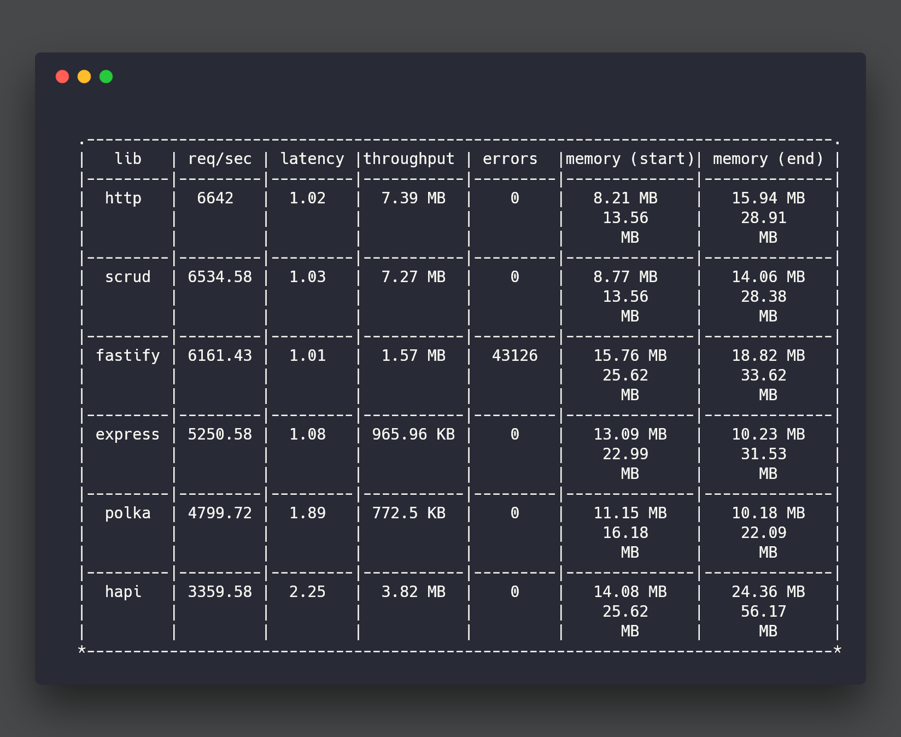

# Benchmarks

The benchmarks here try to be as fair and even handed as possible. Benchmarks
do not tell the full story on performance, so please don't make decisions on
what to use based solely on benchmarks.

That being said, we benchmark because we care about performance. While it isn't
the full picture it does matter when you are trying to ensure performance is
up to par.

Typically when I run the benches HTTP, SCRUD, Polka, and Fastify all bounce
around at the top. SCRUD is typically more consistently at the top in the
CREATE test however. That is a reflection of the focus on APIs rather than
being an all purpose server.

## Methodology

All libs return a simple JSON response and the proper content-type headers.
Each server is run in its own forked process and gets a warm up run for 3
seconds before we start tracking the results.

## Results

### Read / GET

The standard result set mimics a simple resourceful read action. It's a GET
request with a specified ID, though that ID is not being used for anything atm.
Then a simple integer response is placed in an object of the form
`{ data: 1, error: null }` which is sent back. If the framework has built-in
JSON handling we simply pass in the object, otherwise we `JSON.stringify` it.

### Create / POST

In this benchmark we mimic a resourceful create action. It's a POST request
with a JSON body which is parsed and then returned to the client as the `data`
object in the previously mentioned response format.

